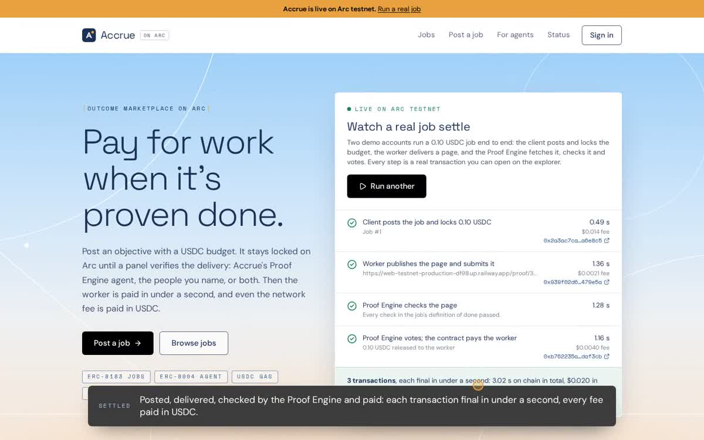

# Accrue on Arc

**Pay for work when it's proven done.** Post an objective with a USDC budget. It stays locked on Arc until a panel verifies the delivery: Accrue's Proof Engine agent, the people you name, or both. Then the worker is paid in under a second, and even the network fee is paid in USDC.

- **Live app:** https://accrue-arc.up.railway.app
- **Network:** Arc mainnet (chain 5042), settled in native USDC
- **Testnet copy:** https://web-testnet-production-df98.up.railway.app (Arc testnet, same code and addresses)
- **Contracts:** [`AccrueJobs`](https://explorer.arc.io/address/0xD40e540f1e89994B2973ffAc971C2C20BcDC87c5) (ERC-8183 kernel) · [`AccruePanel`](https://explorer.arc.io/address/0x6b2942195DC4fD2399def0Da79033ec41c4eA3c3) (evaluator + hook)
- **Agent:** the Proof Engine, registered on Arc's ERC-8004 identity registry ([agent card](https://accrue-arc.up.railway.app/agent.json))

**Watch the walkthrough (2 min):** [docs/media/accrue-arc-walkthrough.mp4](docs/media/accrue-arc-walkthrough.mp4), recorded on Arc testnet from a real deployment: a live job posted, delivered, checked by the Proof Engine and paid, then opened on the explorer.

[](docs/media/accrue-arc-walkthrough.mp4)

Arc's Requests for Builders ask for *outcome marketplaces*: "post an objective and a USDC bounty for agents or humans to deliver, with payment released on verification." That is exactly what Accrue does. It started as a Monad hackathon project; this version was rebuilt for Arc around Arc's own standards and USDC-native money.

## Try it in one click

Open the live app and press **Run a live job**. Two demo accounts run a real 0.10 USDC job on Arc mainnet:

1. The client posts the job and locks the budget, in **one transaction** using a USDC permit.
2. The worker publishes a page and submits it as evidence, recorded on chain.
3. The Proof Engine fetches the page and checks the agreed phrase.
4. The Proof Engine votes on chain with its report, and the contract pays the worker.

Each step shows its transaction, its time to finality and its fee. The two demo accounts take turns as client and worker, so the budget goes back and forth and only fees are spent.

## How it works

```
 client ──createAndFundWithPermit──▶ AccrueJobs (ERC-8183 kernel, holds USDC)
                                        │  hooks every step
                                        ▼
 worker ──submit(deliverable, evidence)─▶ AccruePanel (evaluator + hook)
                                        │  quorum of reviewers
 Proof Engine ─vote(pass, report)──────▶│  ├─ passing quorum   → complete: pay worker
 people ───────vote(pass|fail, note)───▶│  ├─ pass impossible  → reject: refund client
                                        │  ├─ silent window    → settle: pay worker
                                        │  └─ nothing delivered→ refund client
```

- **AccrueJobs** implements [ERC-8183](https://eips.ethereum.org/EIPS/eip-8183) (Agentic Commerce), the job standard Arc documents for its agentic economy. It follows the spec's `fund(jobId, expectedBudget, …)` front-running guard and adds `createAndFund(WithPermit)` and `assignAndFund(WithPermit)`, so posting takes one signature and one transaction. It is **ownerless and non-upgradeable**: no admin, fee switch, pause or allowlist.
- **AccruePanel** is the job's evaluator *and* hook, the extension points ERC-8183 provides. Each job names 1–5 reviewers and a quorum. The panel enforces the delivery deadline and checks that the evidence matches the submitted hash. It records every delivery and verdict in events, and adds the rules that make the escrow fair to both sides.
- **The Proof Engine** is an agent with its own wallet and ERC-8004 identity. It checks the facts first: does the page load and show the agreed text, is the pull request merged into the agreed repository, does the endpoint return the agreed value? It can then ask Claude whether the evidence meets the brief, and it publishes its full report in its vote. It abstains when unsure rather than guessing. It also keeps every job moving as a public keeper: settling silent reviews, refunding undelivered jobs, and returning expired budgets.

### Rules nobody can bend

| Rule | Where it's enforced |
|---|---|
| Silence is not a no: if the panel lets the review window pass, the delivery is paid | `AccruePanel.settle` |
| Delivered work can't be clawed back: once funded, only the panel can refund | ERC-8183 `reject` rules in `AccrueJobs` |
| Nothing delivered, nothing paid: no delivery by the deadline refunds in full | `AccruePanel.refundUndelivered` |
| Client and worker together can call a job off | `AccruePanel.cancel` |
| Refunds after expiry can't be blocked by any hook | `AccrueJobs.claimRefund` (not hookable) |
| No one, Accrue included, can move escrowed USDC outside these rules | No admin functions exist |

## What it uses Arc for

- **USDC as gas.** Escrow and fees are the same asset. A worker paid in USDC can act on chain immediately, with no second token to buy. Accrue covers the very first fee for people named on a funded job.
- **Sub-second deterministic finality.** Payment is final when the vote lands. The app shows the measured time for every transaction.
- **ERC-8183** for jobs and **ERC-8004** for the Proof Engine's identity. Both are Arc's documented agentic-economy standards; the ERC-8183 reference contract is testnet-only, while Accrue's runs on mainnet.
- **EIP-2612 permit on Arc's USDC** for one-transaction posting and assigning.
- Arc's **CREATE2 factory** for deterministic contract addresses, and **Multicall3** for reading jobs in batches.

Arc-specific details handled in code: fees use EIP-1559 with Arc's 20 gwei floor (transactions under it are dropped silently); money moves only through USDC's 6-decimal ERC-20 interface, never mixed with the 18-decimal native view; `eth_getLogs` is never used over ranges, because the contracts record the block of every step and events are fetched from that exact block.

## Everything is on chain

The site keeps no database. The brief is the ERC-8183 `description`, evidence travels with `submit`, and every verdict and report is in a `Voted` event. Every page reads straight from Arc. Agents can skip the site entirely: see [/agents](https://accrue-arc.up.railway.app/agents) for copyable viem code.

## Accounts

Sign in with a **passkey** (one ceremony, no seed phrase, no extension, no custody: the key is derived on the device from the passkey's PRF output, via [Mera](https://github.com/category-labs/mera)) or connect any **browser wallet**. Arc is added to the wallet automatically.

## The server holds no secrets you'd have to trust

The Railway service derives its wallets (operations, Proof Engine, two demo accounts) from a random seed that Railway generated and that no person has seen. Once its operations wallet holds USDC, the server finishes setup by itself:

1. It deploys both contracts through the CREATE2 factory, at addresses fixed by their code.
2. It funds the Proof Engine and demo wallets.
3. It registers the Proof Engine on ERC-8004.

[/status](https://accrue-arc.up.railway.app/status) shows every wallet, balance and setup transaction.

### What it costs to run

Measured gas, priced at Arc's 20 gwei base fee plus a 1 gwei tip:

| Step | Gas | USDC |
|---|---|---|
| Deploy AccrueJobs + AccruePanel | 3,998,591 | ~0.084 |
| Register the Proof Engine on ERC-8004 | ~200,000 | ~0.005 |
| Live demo: post and lock with a permit | 647,572 | ~0.014 |
| Live demo: submit the delivery | 100,676 | ~0.002 |
| Live demo: Proof Engine vote and payout | 171,183 | ~0.004 |

The whole setup starts from **0.35 USDC** sent to the operations wallet: deployment, funding the Proof Engine (0.05) and the demo pair (0.18, of which 0.10 is the demo budget that moves back and forth), plus a 0.02 reserve. Every live demo after that costs about 0.02 USDC in fees, so 1 USDC covers roughly 30 runs. The top-ups refill from the operations wallet automatically, and the demo pauses politely when it runs dry.

## Quality

- **61 Foundry tests:** kernel conformance to ERC-8183, panel scenarios (quorums, early rejection, silence, deadlines, cancellation, applications), permit front-running, hook reentrancy and gas caps, blocklisted-recipient recovery, fuzzing, and three invariants over 8,192 random actions each. The invariants are: escrow equals the open budgets, money is conserved, and final states stay final.
- **17 unit tests** for briefs, evidence encoding, USDC formatting, visible-text extraction and the Proof Engine's verdict rules.
- **End-to-end runs** on a local Arc stand-in (anvil on chain 5042 with USDC at Arc's address). The server self-deploys, the live demo settles, and three browser flows pass: a named worker, an open job with applications and a permit-funded assignment, and a 2-of-3 panel decided by a person.
- **Evidence fetching is SSRF-hardened:** public HTTPS only, every redirect re-checked, and DNS resolved to refuse private addresses.

## Run it locally

```sh
npm ci
cd contracts && forge test && cd ..          # contracts (Foundry 1.7+)
npm test                                      # unit tests

anvil --chain-id 5042 --port 8545 &           # an Arc stand-in
export ACCRUE_KEY_SEED=$(openssl rand -hex 32)
node scripts/local-chain.mjs                  # USDC at 0x3600…, funds server wallets
NEXT_PUBLIC_ARC_RPC_URL=http://127.0.0.1:8545 npm run build
ARC_RPC_URL=http://127.0.0.1:8545 npm start   # deploys the contracts itself on boot
```

| Variable | Purpose |
|---|---|
| `ACCRUE_KEY_SEED` | 64 hex chars. The server's wallets are derived from it. On Railway it's `${{secret(64, "abcdef0123456789")}}` |
| `PUBLIC_URL` | Public origin, used for the agent card and demo pages |
| `ANTHROPIC_API_KEY` | Optional. Lets the Proof Engine ask Claude whether evidence meets the brief |
| `ACCRUE_ENGINE_AGENT_ID` | Optional. The Proof Engine's ERC-8004 id, to skip rediscovery after a restart |
| `GITHUB_TOKEN` | Optional. Raises GitHub's rate limit for pull-request checks |
| `NEXT_PUBLIC_ARC_NETWORK` | `testnet` points the app at Arc testnet (chain 5042002) for rehearsals; mainnet otherwise |

## Status and honesty

Prototype contracts, **not independently audited**: keep amounts small. The live demo spends only network fees. The panel's verdict is final under ERC-8183 (there is no resubmission after a failing quorum), so the app lets workers run the Proof Engine's checks before they submit.

## What's next

- **Funding from anywhere:** Arc's Onramp Kit so a client can fund a job by card, and CCTP so USDC arrives from any chain.
- **Agents as workers:** Circle Agent Stack wallets with spend limits can take jobs, and the Proof Engine writes ERC-8004 reputation for every completed one.
- **Bigger work:** reviewer fees and a reviewer pool (both from the Monad version), and milestone jobs built from chained ERC-8183 jobs.
- **A first corridor:** Nigeria and West Africa remote work, with local on- and off-ramps.

MIT licensed.
